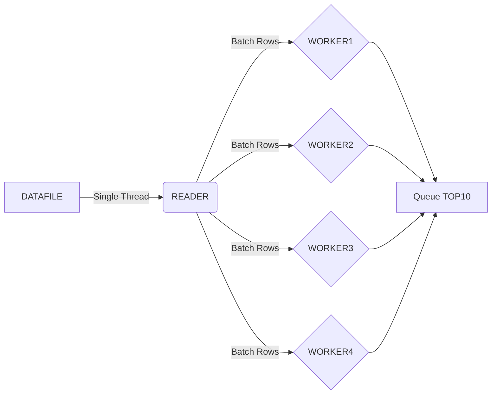

# myClickHouse

All code tested on Linux

## Flow


---
## Running the Project

### Input Data

There is already a dataset file in `data/output.txt` of roughly 400K lines

To generate a different data set (with 1M elements) run
```
cd data
./generate-data.sh 1000000
```

This will take a few hours to complete

### Running the Parser

To run the parser with the `output.txt` file in the data directory
```
cd parser
make run
```

to Run the parser with another file as input 
```
cd parser
make build
echo "PATH_TO_THE_FILE" | ./parser
```

### Runing Tests
To run the simple test
```
cd parser
make clean
make test
```

---
## Benchmarks

### 10000000 Lines
```
➜ wc -l /dev/shm/output.txt
10000000 /dev/shm/output.txt
```
```
http://api.tech.com/item/6126076
http://api.tech.com/item/3005721
http://api.tech.com/item/3840952
http://api.tech.com/item/5578794
http://api.tech.com/item/4826592
http://api.tech.com/item/5911094
http://api.tech.com/item/6327491
http://api.tech.com/item/2236773
http://api.tech.com/item/3735303
http://api.tech.com/item/1017977

real    0m4.994s
user    0m7.627s
sys     0m0.731s
```
```
➜ bash -c "time ( cat /dev/shm/output.txt | sort -k 2 -n -r | head -n 10 )"
http://api.tech.com/item/6126076 4294967182
http://api.tech.com/item/3005721 4294966996
http://api.tech.com/item/3840952 4294965139
http://api.tech.com/item/5578794 4294965108
http://api.tech.com/item/4826592 4294965080
http://api.tech.com/item/5911094 4294963506
http://api.tech.com/item/6327491 4294963137
http://api.tech.com/item/2236773 4294962630
http://api.tech.com/item/3735303 4294962069
http://api.tech.com/item/1017977 4294960675

real    0m25.294s
user    0m24.546s
sys     0m0.713s
```
