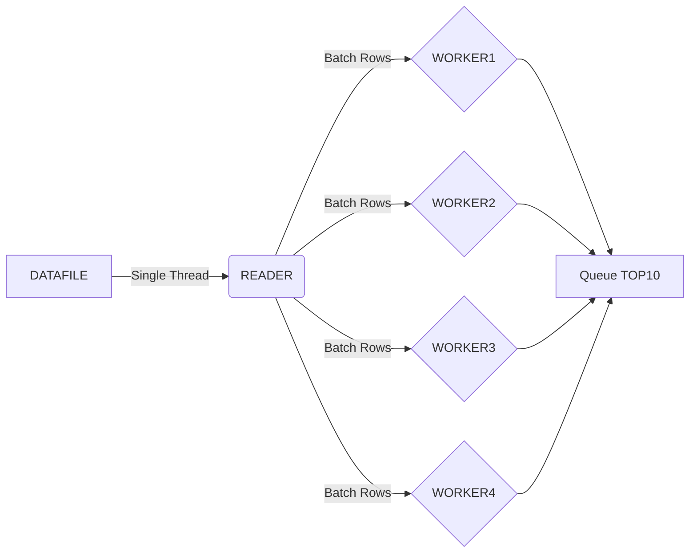

# ClickHouse Test

**Note**: All code tested on Linux

**TOC**
* [Application Flow and Description](#application-flow-and-description)
* [Usage](#usage)
  * [Input Data Set](#input-data)
  * [Running the Parser](#running-the-parser)
  * [Tests](#runnig-tests)
* [Benchmarks](#benchmarks)

## Application Flow and Description



### Reading the datafile

The reading of the lines from the datafile is done through a `single routine` to keep the read operation simple without the need to track the position for each read thread. Parallelizing reading might be much easier if multiple input files were to be used.

While not ideal this will not be a problem unless the read of data gets CPU bound which should not happen as long as the `processing` of the records is the most intensive operation for which the _spare_ threads are used

The lines read from the datafile are split into batches to be processed by each worker thread through a `channel` shared between those routines

### Processing the records

I assumed this would be the most `demanding` threads from a CPU point of view and so those are the only routines for which multiple threads are used. 

Each worker thread pulls a `batch` of lines from the `channel` shared with the read thread , build an `Item` and push it into a `channel` shared with the `QueueManager` thread 

### Queue Manager

The list of elements with the `highest value` is managed through a `priority queue` using the `heap container` packages. 

From `Wikipedia` : `A heap is usually an array of objects that can be thought of as a tree. In a queue` 

In the case of this Parser we are only interested in the `TOP 10` elements ( by priority/value ) in the queue but , as described in the docs, `The complexity is O(log n) where n = h.Len()`, so in order to keep the queue as small as possible (and so the complexity of any queue operation) at any given time the `LESS` function has been modified to allow for `POP()` to return the `lowest priority` element in the queue. 

A separate `go routine` is used as a `Queue Manager` because the heap is not thread safe and so it can't be handled by multiple worker thread at the same time. A channel is used to push `Items` from the worker threads into the queue manager thread which then `Pushes` Items into the queue, prioritize them according to the Value and pop low priority elements out when the queue is bigger than 10

---
## Usage

### Input Data

There is already a dataset file in `data/data.txt` of roughly 400K lines

To generate a different data set (with 1M elements) run
```
make data DATASIZE=1000000
```

This will take a `while` to complete

### Running the Parser

To run the parser with the `data.txt` file in the data directory
```
make run
```

to Run the parser with another file as input 
```
make build
echo "PATH_TO_THE_FILE" | ./parser/parser
```

### Runnig Tests
To run the simple test
```
make test
```

---
## Benchmarks

### 10000000 Lines
*10M lines in the data file*
```
➜ wc -l /dev/shm/data.txt
10000000 /dev/shm/data.txt
```

*Use the parser* 
```
➜ bash -c "time (echo "/dev/shm/data.txt"| ./parser/parser)"
http://api.tech.com/item/6126076
http://api.tech.com/item/3005721
http://api.tech.com/item/3840952
http://api.tech.com/item/5578794
http://api.tech.com/item/4826592
http://api.tech.com/item/5911094
http://api.tech.com/item/6327491
http://api.tech.com/item/2236773
http://api.tech.com/item/3735303
http://api.tech.com/item/1017977

real    0m4.982s
user    0m7.741s
sys     0m0.748s
```
*Use Linux tools* 
```
➜ bash -c "time ( cat /dev/shm/data.txt | sort -k 2 -n -r | head -n 10 )"
http://api.tech.com/item/6126076 4294967182
http://api.tech.com/item/3005721 4294966996
http://api.tech.com/item/3840952 4294965139
http://api.tech.com/item/5578794 4294965108
http://api.tech.com/item/4826592 4294965080
http://api.tech.com/item/5911094 4294963506
http://api.tech.com/item/6327491 4294963137
http://api.tech.com/item/2236773 4294962630
http://api.tech.com/item/3735303 4294962069
http://api.tech.com/item/1017977 4294960675

real    0m25.294s
user    0m24.546s
sys     0m0.713s
```
